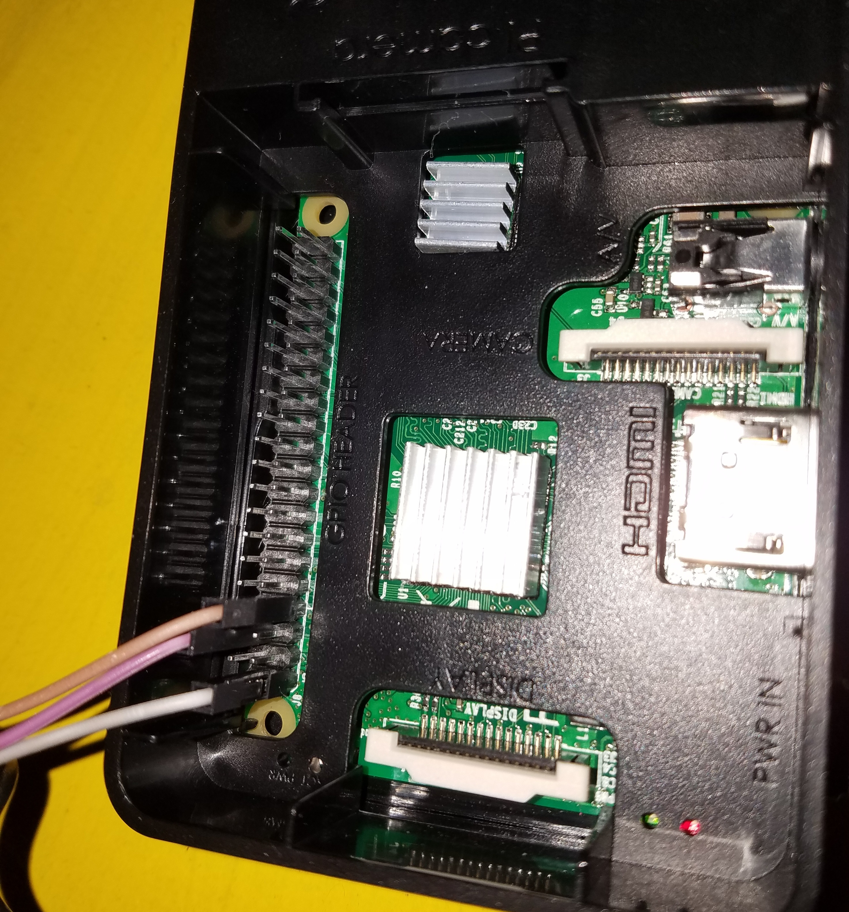
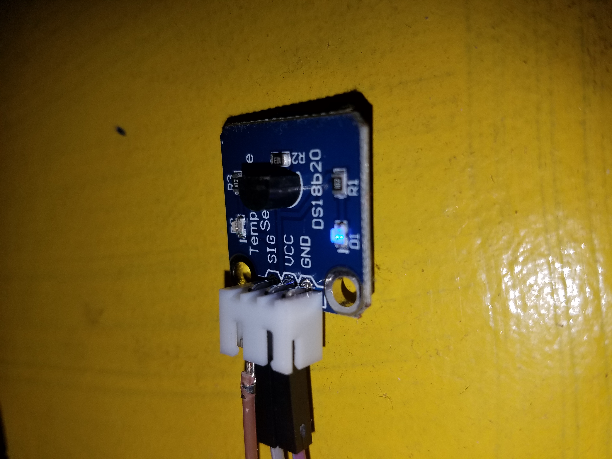

# Temperature History

This is a small side project to record indoor temperatures in the house 24/7 for eventual long-term analysis.  Our house is heated with small electric wall heaters and a wood stove, has no central cooling, and is also fairly drafty. Therefore, substantial temperature changes are noticable throughout the day and from season to season.

[View it in action](https://www.kolls.net/temperature)

# Raspberry Pi - Hardware

I connected [DS18b20 temperature sensor](https://www.amazon.com/gp/product/B013GB27HS/) to my Raspberry Pi 3. Notably, the connection cable included in the package was male terminated and so could not connect directly to the Pi.  A coworker gave me female terminated connectors and a direct connection from the Pi to the sensor works just fine.  Most tutorials show an intermediate breadboard.  The sensor I purchased (shown in the link) can be connected directly.

On the Pi, I attached the 3.3V, ground, and GPIO4 for power, ground, and signal, respectively.

The sensor I let free stand.  Reviews of this particular sensor seem to indicate that it is quite accurate.

# Raspberry Pi - Software

The Pi requires some small configuration to be able to read the temperature from the sensor.  I followed [Adafruit's tutorial](https://cdn-learn.adafruit.com/downloads/pdf/adafruits-raspberry-pi-lesson-11-ds18b20-temperature-sensing.pdf) to setup the Pi and it worked immediately. 

I then completed [two small Python scripts](pi/): one to read and record the temperature, and one to upload the result.  The read and record is run every minute by cron job.  It turns the temperature into Farenheit and doubles it, and then stores the integer result as a single unsigned byte.  This gives a temperature range of 0 F to 127 F at a resolution of 0.5 F, plenty of room for my purpose.  The read and store program identifies and pads the file for any disruptions in reading. A coworker suggested I should store the value in a database, but small binary files are easy and portable, so I used those instead.

The upload job is run daily (right after midnight), uploading the previous day's temperature reading file to the server.

# Web

To visualize this data I used [D3.js](https://d3js.org/) to plot the data in an SVG chart.  

The [program](web/) supports pan and zoom, automatically reads in additional daily files as needed.  The program is written in ES6 style natively, since it is primarily for personal use and I don't need to support old browser.
